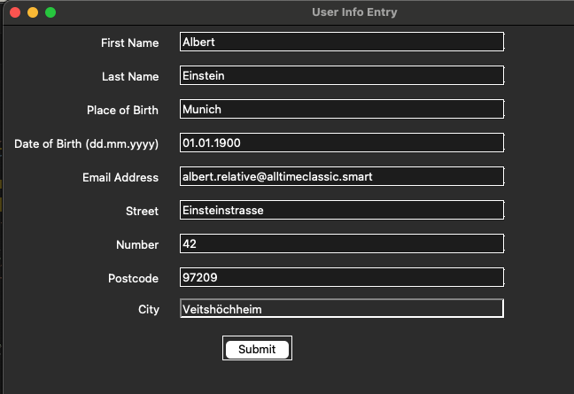
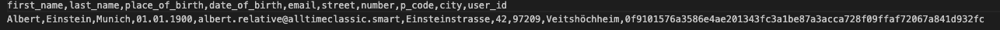
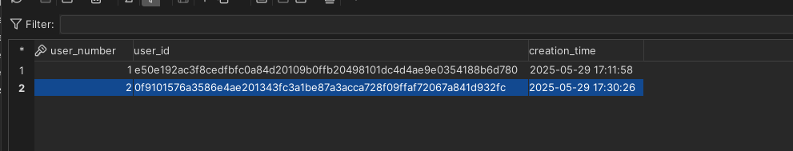

# Sports Buddies Plugin

A matching plugin to help people find others with similar sports interests.

## Features
- Match users based on their preferred sports and location
- Seamlessly integrates with your existing application
- Common swipe-right interaction to connect with others
- Simple and user-friendly interface

---

## Step 1 – Create a Virtual Environment

**For macOS users:**

```bash
uv venv
source .venv/bin/activate
uv pip compile requirements.in > requirements.txt
uv pip install -r requirements.txt
```

---

## Step 2 – Log in to DBVisualizer with Your Credentials

- Change your password by running the following SQL command on the `who_am_i_data_sink` database:

```sql
ALTER USER your_user_name PASSWORD 'new_password';
```

- After that, you should have access to the database.

---

## Step 3 – Create a Data Folder (Ignored by Git)

This folder is required to store local configuration and will **not** be pushed to GitHub due to `.gitignore`.

**For macOS users:**

```bash
mkdir data
```

Then, create a `config.txt` file inside that folder with your connection details with the following bash
**please change the ipm port number user and password to your data**:

```bash
echo host=your_host_ip > data/config.txt
echo port=your_port_number >> data/config.txt
echo database=who_am_i_data_sink >> data/config.txt
echo user=your_username >> data/config.txt
echo password=your_password >> data/config.txt
```

Then, create a `config_raw.txt` file inside that folder with your connection details for the data_dump Database with the following bash
**please change the ipm port number user and password to your data**:

```bash
echo host=your_host_ip > data/config.txt
echo port=your_port_number >> data/config.txt
echo database=who_am_i_raw >> data/config.txt
echo user=your_username >> data/config.txt
echo password=your_password >> data/config.txt
```

*Ask Dave for the correct IP, port, and credentials.*

---

## Step 4 – Create a New User

Run the following Python script:

```bash
python 01_new_user.py
```

This will open a **Tkinter input form**:



- Pressing **Submit** will save the user information **locally** (and only locally) in your `data` folder.
- A **hashed user ID** will be generated and saved alongside the personal data in `secret_info.csv`:
- The "event_data.jsom" will be uploaded to the data_dump Database



- Finally, a new entry will be added to all the tables in the `who_am_i_data_sink` database.  
  This includes:
  - a new `user_number` in all tables
  - the hashed `user_id` in_dim_user
  - a `creation_time` timestamp in _dim USer


